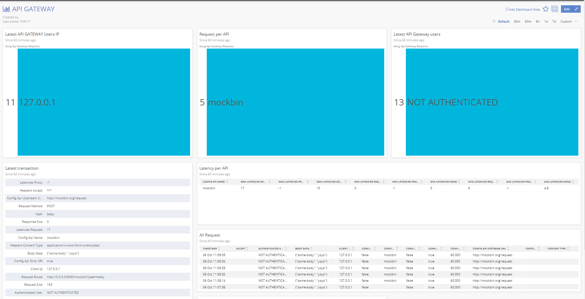

# Kong Newrelic-insights plugin

## Newrelic Insights example

## Test with kong-vagrant VM

Don't forget to prepare the kong software for developement

    cd /kong && make dev

Make sure your newrelic plugin is available in Kong plugins folder

    ln -sfn /kong-plugin/kong-plugin-newrelic-insights/kong/plugins/newrelic-insights /kong/kong/plugins/newrelic-insights

Tell kong to use the Newrelic plugin and record logs in debug mode

    export KONG_CUSTOM_PLUGINS="newrelic-insights" && export KONG_LOG_LEVEL=debug && export KONG_PREFIX=/kong/servroot

Easy commands to test the plugin

    kong migrations up
    kong start
    curl -i -X POST   --url http://localhost:8001/apis/   --data 'name=mockbin'   --data 'upstream_url=http://mockbin.org/request'   --data 'uris=/mockbin'
    curl -i -X POST   --url http://localhost:8001/apis/mockbin/plugins/   --data 'name=newrelic-insights' --data 'config.api_key=YOUR-NEWRELIC-API-KEY' --data 'config.account_id=YOUR-NEWRELIC-ACCOUNT-ID' --data 'config.environment_name=dev'
    curl "0.0.0.0:8000/mockbin?yeah=baby" --data '{"someVariables": "une value"}'
    curl -i -X DELETE   --url http://localhost:8001/apis/mockbin
    
# Ready for luarocks deployment 
    
   https://luarocks.org/modules/JnMik/kong-plugin-newrelic-insights
   
# To install in Kong while running in Docker Container

    RUN yum install -y unzip
    RUN cd /usr/local/share/lua/5.1/kong && luarocks install kong-plugin-newrelic-insights
